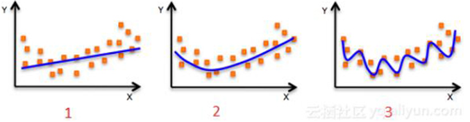

### 1. (单选题)下面有关分类算法的准确率，召回率，F1值的描述，错误的是？

- A.准确率是检索出相关文档数与检索出的文档总数的比率，衡量的是检索系统的查准率
- B.召回率是指检索出的相关文档数和文档库中所有的相关文档数的比率，衡量的是检索系统的查全率
- C.正确率、召回率和 F 值取值都在0和1之间，数值越接近0，查准率或查全率就越高
- D.为了解决准确率和召回率冲突问题，引入了F1分数

==C==

### 2. (单选题)评估完模型之后，发现模型存在高偏差（high bias），应该如何解决？

- A. 减少模型的特征数量
- B. 增加模型的特征数量
- C. 增加样本数量
- D. 以上说法都正确

==B==

### 3. (单选题)下面哪句话是正确的？  

- A. 机器学习模型的精准度越高，则模型的性能越好
- B. 增加模型的复杂度，总能减小测试样本误差
- C. 增加模型的复杂度，总能减小训练样本误差
- D. 以上说法都不对

==C==

### 4. (单选题)下面有关分类算法的准确率，召回率，F1 值的描述，错误的是？

- A.准确率是检索出相关文档数与检索出的文档总数的比率，衡量的是检索系统的查准率
- B.召回率是指检索出的相关文档数和文档库中所有的相关文档数的比率，衡量的是检索系统的查全率
- C.正确率、召回率和 F 值取值都在 0 和 1 之间，数值越接近 0，查准率或查全率就越高
- D.为了解决准确率和召回率冲突问题，引入了F1分数

==C==

### 5.(判断题)小刚去应聘某互联网公司的算法工程师，面试官问他“回归和分类有什么相同点和不同点”，他说了以下言论，请逐条判断是否准确。 1）回归和分类都是有监督学习问题;

- A. 对
- B. 错

==A==

### 6.(判断题)回归问题和分类问题都有可能发生过拟合（   ）;

- A. 对
- B. 错

==A==

### 7.(判断题)一般来说，回归不用在分类问题上，但是也有特殊情况，比如logistic 回归可以用来解决0/1分类问题;

- A. 对
- B. 错

==A==

### 8.对回归问题和分类问题的评价最常用的指标都是准确率和召回率;

- A. 对
- B. 错

==B==

### 9.(判断题)输出变量为有限个离散变量的预测问题是回归问题； 输出变量为连续变量的预测问题是分类问题；

- A. 对
- B. 错

==B==

### 10.(判断题)判断这个说法对不对：给定 n 个数据点，如果其中一半用于训练，另一半用于测试，则训练误差和测试误差之间的差别会随着 n的增加而减小;

- A. 对
- B. 错

==A==

### 11.(单选题)下图显示了对相同训练数据的三种不同拟合模型(蓝线标出)，从中可以得出什么结论?

### 1.同第二第三个模型相比，第一个模型的训练误差更大

### 2.该回归问题的最佳模型是第三个，因为它有最小的训练误差

### 3.第二个模型比第一、第三个鲁棒性更好，因为它在处理不可见数据方面表现更好

### 4.相比第一、第二个模型，第三个模型过拟合了数据

### 5.因为我们尚未看到测试数据，所以所有模型表现一致  

- A.1和3  
- B.1和2  
- C.1，3和4  
- D.只有5

==C==

### 12.(单选题)线性回归能完成的任务是（  ）

- A.预测离散值
- B.预测连续值
- C.分类
- D.聚类

==B==

### 13.(单选题)下列两个变量之间的关系中，那一个是线性关系（   ）

- A.学生的性别与他（她）的数学成绩
- B.人的工作环境与他的身体健康状况
- C.儿子的身高与父亲的身高
- D.正方形的边长与周长

==D==

### 14.(单选题)产量（X，台）与单位产品成本（y,元/台）之家你的回归方程为y=356-1.5x，这说明（    ）

- A.产量每增加一台，单位产品成本增加356元
- B.产品每增加一台，单位产品的成本减少1.5元
- C.产量每增加一台，单位产品的成本平均增加356元
- D.产量每增加一台，单位产品成本平均减少1.5元

==D==

### 15.(单选题)以y true 表示观测值，y hat 表示回归估计值，则普通最小二乘法估计参数的准则是 （  ）

- A. 
- B. 
- C. 
- D. 

==D==

### 16.(单选题)直线方程y=wx+b,其中b表示（    ）

- A.系数 
- B.截距
- C.斜率 
- D.权重

==B==

### 17.(多选题)如下图所示，对同一数据集进行训练，得到3个模型。对于这3个模型的评估，下列说法正确的是？（多选） 

- A.第一个模型的训练误差最大
- B.第三个模型性能最好，因为其训练误差最小
- C.第二个模型最稳健，其在测试集上表现应该最好
- D.第三个模型过拟合

==ACD==

### 18.(多选题)以下描述中，对梯度解释正确的是（   ）

- A.梯度是一个向量，有方向有大小
- B.求梯度就是对梯度向量的各个元素求偏导
- C.梯度只有大小没有方向
- D.梯度只有方向没有大小

==AB==

###  19.(多选题)关于误差ε的说法正确的是（   ）

- A.误差可以看做随机比变量
- B.误差的概率分布符合正态分布
- C.误差的概率分布符合均匀分布
- D.如果模型设计优良，误差可以避免

==AB==

### 20.(多选题)下列哪些算法属于最优解算法（   ）  

- A.解析解
- B.最小二乘法
- C.梯度下降法
- D.最大似然估计

==AC==

### 21.(填空题)模型评估方法有，留出法、（   ）、自助法， 调参与最终模型。

==交叉验证==

### 22.(填空题)通常采用一个“测试集”来测试学习器对新样本的判别能力，然后以“测试集”上的“测试误差”作为（  ）的近似。

==泛化误差==

### 23.(填空题)以二分类任务为例，假定D包含1000个样本，将其划分为S包含700个样本，T包含300个样本，用S进行训练后，如果模型在T上有90个样本分类错误，那么其错误率为（   ），相应的，精度为70%。

==（90/300）*100%=30%==

### 24.(填空题)通过对D进行分层采样而获得含70%样本的训练集S和含30%样本的测试集T。若D包含500个正例、500个反例，则分层采样得到的S应包含350个正例、350个反例，而T则包含150个正例和（  ）个反例。

==150==

### 25.(填空题)算法的参数：一般由（  ），亦称“超参数”，模型的参数：一般由学习确定。

==人工设定==

### 26.(判断题)泛化误差越小越好，试问经验误差是否越小越好？

- A. 对
- B. 错

==B==

### 27.(单选题)有两个样本点，第一个点为正样本,它的特征向量是(0,-1);第二个点为负样本,它的特征向量是(2,3),从这两个样本点组成的训练集构建一个线性SVM分类器的分类面方程是()

- A. 2x+y=4 
- B. x+2y=5 
- C. x+2y=3 
- D. 2x-y=0

==C==

### 28.(单选题)关于支持向量机SVM,下列说法错误的是（）

- A.L2正则项，作用是最大化分类间隔，使得分类器拥有更强的泛化能力
- B.Hinge 损失函数，作用是最小化经验分类错误
- C.分类间隔为1/||w||，||w||代表向量的模
- D.当参数C越小时，分类间隔越大，分类错误越多，趋于欠学习

==C==

### 29.(单选题)下列不是SVM核函数的是（）

- A. A.多项式核函数 
- B. B.logistic核函数 
- C. C.径向基核函数 
- D. D.Sigmoid核函数

==B==

###  30.(单选题)假如我们使用非线性可分的SVM目标函数作为最优化对象, 我们怎么保证模型线性可分？

- A. 设C=1  
- B. 设C=0  
- C. 设C=无穷大  
- D. 以上都不对

==C==

### 31.(单选题)对于在原空间中线性不可分的问题，支持向量机（   ）。  

- A.在原空间中寻找非线性函数划分数据
- B.利用核函数把数据映射到高维空间
- C.在原空间中寻找线性函数划分数据
- D.无法处理
- ==B==

###  32.(单选题)怎样理解非完美分类的超平面分类器（   ）  

- A.允许小部分训练观测被误分。
- B.允许大部分训练观测被误分。
- C.两种说法都对。
- D.两种说法都不对。

==A==

### 33.(单选题)关于支持向量机SVM，说法正确的是（   ）  

- A.边缘(margin)是决策边界与任意样本之间的平均距离
- B.支持向量 (support vector) 位于最大边缘超平面附近的点
- C.分类间隔为1/||w||，||w||代表向量的模
- D.决策边界只会被支持向量影响，跟其他点无关

==D==

### 34.(单选题)线性可分支持向量机：给定线性可分训练数据集，通过间隔（）为目标，求解相应的凸二次规划问题，从而学习得到的最优分离超平面，此时解是（    ）的。 

- A.最大 不唯一
- B.最大 唯一
- C.最小 唯一
- D.最小 不唯一

==B==

### 35.SVM算法的性能取决于：（   ）  

- A.软间隔参数
- B.核函数的参数
- C.核函数的选择
- D.以上所有

==D==

### 36.(单选题)SVM中的代价参数C表示什么？（   ）  

- A.交叉验证的次数
- B.在分类准确性和模型复杂度之间的权衡
- C.用到的核函数
- D.以上都不对

==B==

### 37.(单选题)下列有关支持向量机说法不正确的是：（  ）  

- A.具有很好的推广能力
- B.是凸二次优化问题
- C.得到的是局部最优解
- D.采用结构风险最小化原理

==C==

### 38.(单选题)下列有关核函数不正确的是：（  ）  

- A.满足Mercer条件的函数不一定能作为支持向量机的核函数
- B.可以采用cross-va1idalion方法选择最佳核函数
- C.极大地提高了学习机器的非线性处理能力
- D.函数与非线性映射并不是一一对应的关系

==A==

### 39.(单选题)一对一法分类器，k个类别需要多少个SVM：（  ）  

- A. k(k-1)/2
- B. k(k-1)
- C. k
- D. k!

==A==

### 40. (单选题)怎样理解非完美分类的超平面分类器？（   ）  

- A.允许小部分训练观测被误分。
- B.允许大部分训练观测被误分。
- C.两种说法都对。
- D.两种说法都不对。

==A==

### 41.(单选题)SVM算法的最小时间复杂度是O(n*n)。基于这一点，以下哪种规格的数据集并不适用于该算法？（  ）  

- A.大数据集
- B.小数据集
- C.中数据集
- D.不受数据集大小的影响

==A==

### 42.(单选题)假定现在有一个四分类问题，你要用One-vs-all策略训练一个SVM的模型，你需要训练几个SVM模型？（  ）  

- A. 1
- B. 2
- C. 3
- D. 4

==D==

### 43.(多选题)在分类问题中,我们经常会遇到正负样本数据量不等的情况,比如正样本为10w条数据,负样本只有1w条数据,以下最合适的处理方法是（）

- A.将负样本重复10次,生成10w样本量,打乱顺序参与分类
- B.直接进行分类,可以最大限度利用数据
- C.从10w正样本中随机抽取1w参与分类
- D.将负样本每个权重设置为10,正样本权重为1,参与训练过程

==ACD==

### 44.(判断题)训练完SVM模型后, 不是支持向量的那些样本我们可以丢掉, 也可以继续分类: 

- A. 对
- B. 错

==A==

### 45.(判断题)支持向量是最靠近决策表面的数据点。

- A. 对
- B. 错

==A==

### 46.(判断题)凸优化的任何局部最优解就是全局最优解。

- A. 对
- B. 错

==A==

### 47.(判断题)SVM中的泛化误差代表SVM对新数据的预测准确度。

- A. 对
- B. 错

==A==

### 48.(判断题)若参数C（costparameter）被设为无穷，只要最佳分类超平面存在，它就能将所有数据全部正确分类。

- A. 对
- B. 错

==A==

###  49.(判断题)“硬间隔”是指SVM允许分类时出现一定范围的误差。

- A. 对
- B. 错

==B==